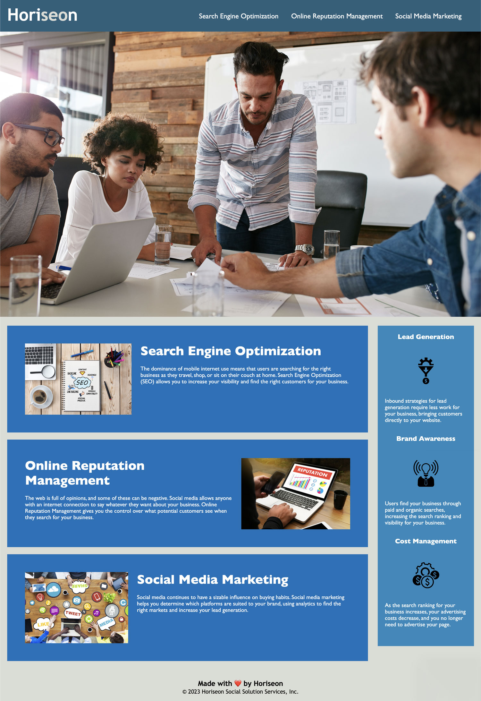

# Module 1 Challenge: code refractor
This project has been finished folliwing the next requirements:

## User story-

AS A marketing agency
* I WANT a codebase that follows accessibility standards
SO THAT our own site is optimized for search engines

## Acceptance criteria

GIVEN a webpage meets accessibility standards
* WHEN I view the source code,
THEN I find semantic HTML elements
* WHEN I view the structure of the HTML elements,
THEN I find that the elements follow a logical structure independent of styling and positioning
* WHEN I view the image elements,
THEN I find accessible alt attributes
* WHEN I view the heading attributes,
THEN they fall in sequential order
* WHEN I view the title element,
THEN I find a concise, descriptive title

## Go to my project

To visit and review my project, [click here](https://vanzittle.github.io/module1-challenge/Develop)

## Visual reference of project
The following image demonstrates the website's appearance:

© 2024, Vanessa Z.